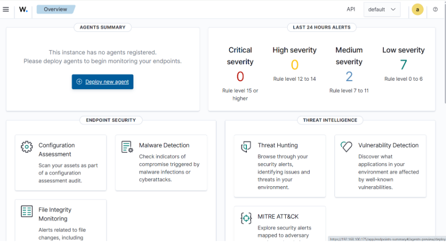
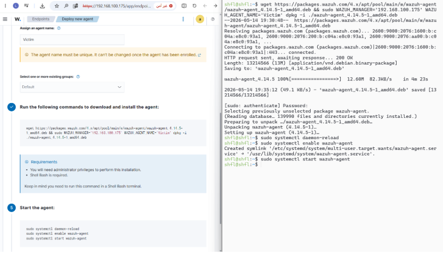
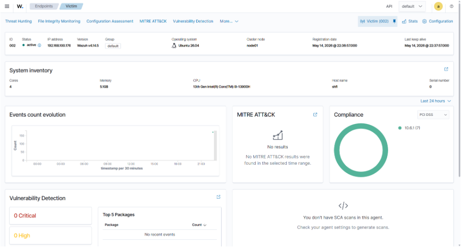
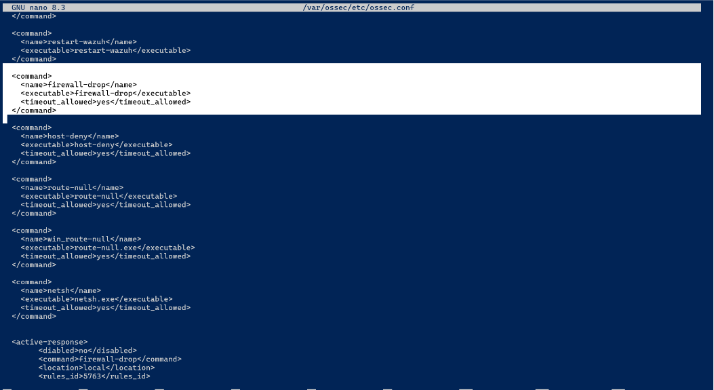
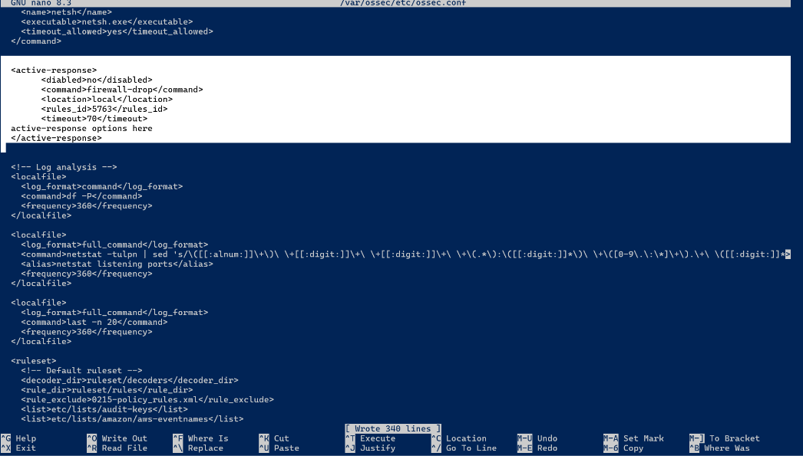
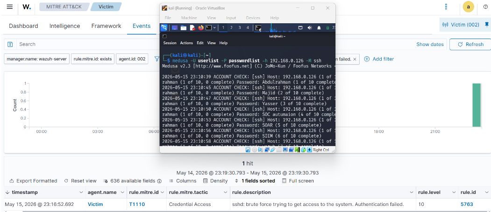
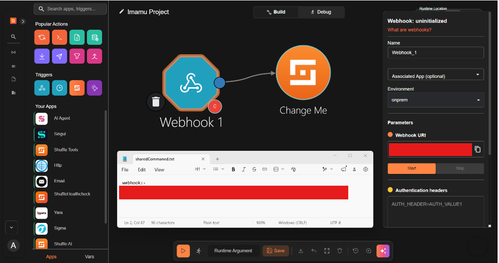
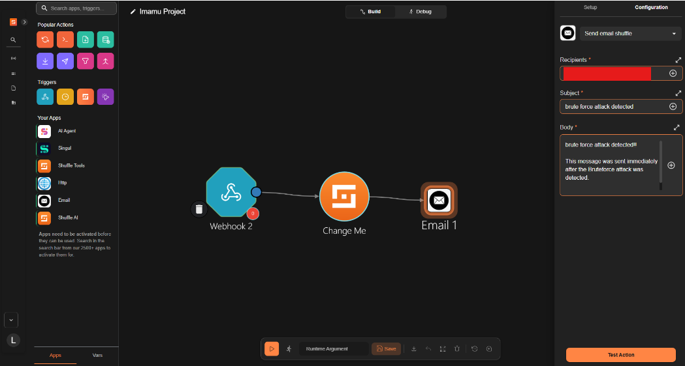
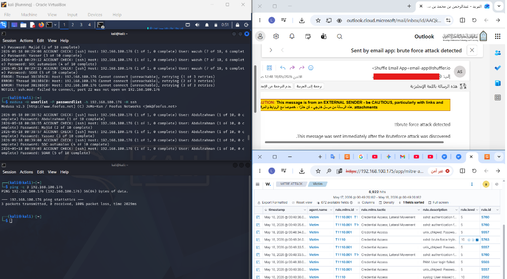

# SOC Automation using Wazuh SIEM and Shuffle SOAR

## Overview

This project demonstrates the design and implementation of a Security Operations Center (SOC) Automation environment using **Wazuh SIEM** and **Shuffle SOAR**. The primary objective is to automate the detection, containment, and notification processes associated with SSH brute-force attacks while reducing manual intervention and improving incident response efficiency.

The project was developed within a controlled virtual lab environment to simulate a real-world cyber attack scenario. By integrating security monitoring, automated response mechanisms, and orchestration workflows, the solution provides a practical demonstration of modern SOC operations.

---

## Project Objectives

* Build a virtual SOC environment.
* Simulate real-world SSH brute-force attacks.
* Monitor security events using Wazuh.
* Automatically detect malicious authentication attempts.
* Contain threats using Wazuh Active Response.
* Integrate Wazuh with Shuffle SOAR using Webhooks.
* Automate incident notification workflows.
* Reduce Mean Time To Respond (MTTR).
* Demonstrate the practical value of SIEM and SOAR integration.

---

## Architecture

The project environment consists of the following components:

### Attacker Machine

* Kali Linux
* Used to simulate SSH brute-force attacks.

### Victim Server

* Ubuntu Server
* Hosts SSH services.
* Runs the Wazuh Agent.
* Generates authentication logs.

### Wazuh SIEM

* Wazuh Manager
* Security Monitoring
* Event Correlation
* Threat Detection
* Alert Generation
* Active Response

### Shuffle SOAR

* Workflow Automation
* Security Orchestration
* Alert Processing
* Automated Notification

---

## Architecture Flow

```text
Kali Linux (Attacker)
        │
        ▼
SSH Brute Force Attack
        │
        ▼
Ubuntu Server (Victim)
        │
        ▼
Wazuh Agent
        │
        ▼
Wazuh Manager
        │
        ├── Rule 5763 Detection
        │
        ├── Active Response
        │       │
        │       └── Firewall Drop
        │
        ▼
Webhook Integration
        │
        ▼
Shuffle SOAR
        │
        ▼
Email Notification
        │
        ▼
SOC Analyst
```

---

## Technologies Used

| Technology          | Purpose               |
| ------------------- | --------------------- |
| Wazuh               | SIEM Platform         |
| Shuffle             | SOAR Platform         |
| Ubuntu Server       | Victim System         |
| Kali Linux          | Attack Simulation     |
| Oracle VirtualBox   | Virtualization        |
| SSH                 | Target Service        |
| Webhooks            | Integration Mechanism |
| Active Response     | Automated Containment |
| Email Notifications | Incident Alerting     |

---

## Detection Workflow

### Phase 1 – Attack Simulation

A brute-force attack is launched from the Kali Linux machine against the Ubuntu victim server using automated password attempts.

### Phase 2 – Log Collection

The Wazuh Agent continuously monitors:

```text
/var/log/auth.log
```

Authentication events are forwarded to the Wazuh Manager in real time.

### Phase 3 – Threat Detection

The Wazuh Manager analyzes incoming logs and matches the attack behavior against predefined security rules.

The project specifically utilizes:

```text
Rule ID: 5763
```

which detects SSH brute-force attacks.

### Phase 4 – Automated Containment

Once the attack is detected, Wazuh Active Response automatically executes:

```text
firewall-drop
```

The attacker's IP address is blocked for 70 seconds.

### Phase 5 – SOAR Automation

The generated alert is forwarded to Shuffle using a Webhook integration.

Shuffle automatically:

* Receives the alert.
* Processes JSON data.
* Extracts attack information.
* Executes the workflow.

### Phase 6 – Incident Notification

An automated email notification is generated and sent to the SOC team containing:

* Attacker IP Address
* Victim Hostname
* Detection Timestamp
* Alert Severity
* Rule Information

---

## Active Response Configuration

The project utilizes Wazuh Active Response to automatically contain threats.

The response mechanism:

* Detects brute-force activity.
* Triggers Rule 5763.
* Executes firewall-drop.
* Blocks attacker communication.
* Automatically removes the block after the configured timeout.

This approach demonstrates machine-speed incident response without requiring analyst intervention.

---

## Challenges Encountered

### Wazuh Manual Installation

The project initially attempted a manual deployment of Wazuh on Ubuntu Server.

Several issues were encountered:

* Dependency conflicts
* Service configuration complexity
* Deployment instability
* Time-consuming troubleshooting

### Solution

The team adopted the official Wazuh OVA appliance, providing a stable and preconfigured deployment environment.

---

### Agent Connectivity Issues

Several attempts were required to establish stable communication between the Wazuh Manager and the victim machine.

### Solution

Network settings, manager IP configuration, and agent registration were validated and corrected.

---

### Shuffle Integration Issues

The integration between Wazuh and Shuffle required extensive testing.

Challenges included:

* Webhook validation
* Payload formatting
* Alert forwarding
* Workflow execution

### Solution

Custom integration blocks were configured and tested until reliable communication was achieved.

---

## Results

The project successfully demonstrated:

* Real-time attack detection.
* Automated threat containment.
* Successful Wazuh and Shuffle integration.
* Automated email notifications.
* Reduced Mean Time To Respond (MTTR).
* Improved operational efficiency.

During testing:

* SSH brute-force attacks were detected successfully.
* Rule 5763 triggered as expected.
* Attacker IP addresses were blocked automatically.
* Shuffle workflows executed successfully.
* Email notifications were delivered correctly.

---

## Security Benefits

This implementation demonstrates several key advantages of SOC automation:

* Faster incident response.
* Reduced analyst workload.
* Consistent response procedures.
* Lower operational overhead.
* Improved security visibility.
* Reduced risk of human error.

---

## Future Improvements

Potential future enhancements include:

* VirusTotal integration.
* Threat Intelligence Platforms (TIP).
* Endpoint Detection and Response (EDR).
* XDR integration.
* Microsoft Teams notifications.
* Slack integration.
* Automated ticket creation.
* Machine Learning-based anomaly detection.
* Phishing response automation.
* Malware response workflows.
## Screenshots

### Wazuh Dashboard



### Wazuh Agent Deployment



### Active Agent



### Active Response Configuration



### Rule 5763 Detection



### SSH Brute Force Attack



### Shuffle Webhook Integration



### Shuffle Workflow



### Final Result


---

## Conclusion

This project successfully demonstrates how SIEM and SOAR technologies can be combined to create an automated and scalable Security Operations Center environment.

By integrating Wazuh SIEM with Shuffle SOAR, the implemented architecture was capable of detecting SSH brute-force attacks, automatically containing threats, and notifying security personnel without manual intervention.

The results highlight the practical benefits of SOC automation and demonstrate how modern organizations can leverage security orchestration and automated response mechanisms to improve resilience against evolving cyber threats.

---

## Team Members

This project was developed collaboratively by:

Yasser

Abdulrahman

Majed


Cybersecurity Department

2026
